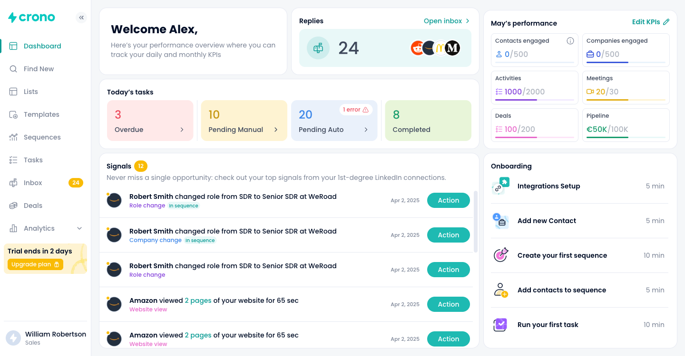
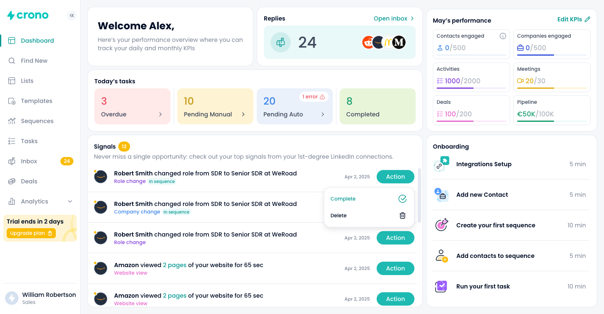
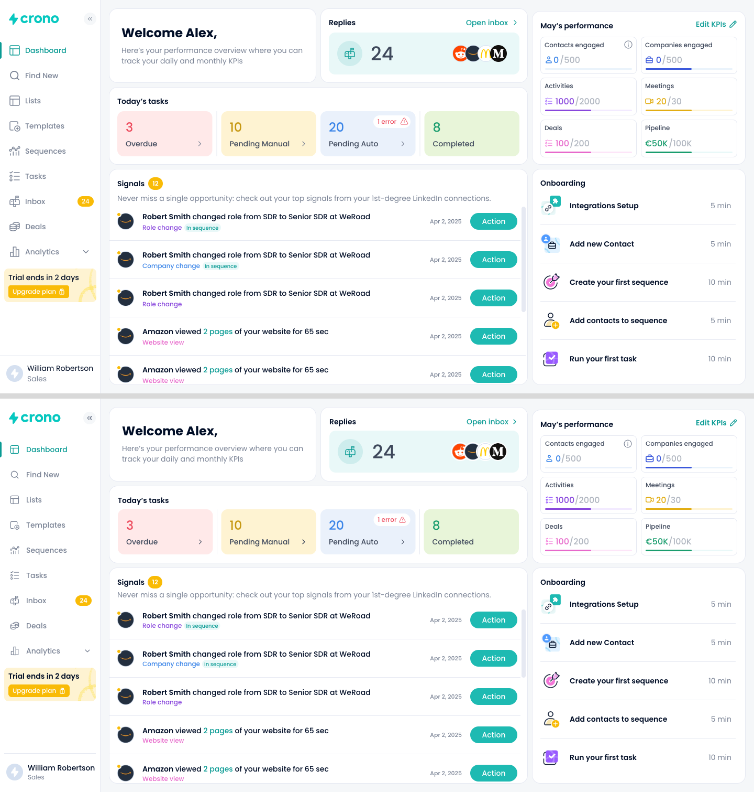

# Crono — Dashboard

A pixel-faithful rebuild of the Crono dashboard screen from the provided Figma design, in
React + TypeScript.

**Live:** <https://frontend-challenge-crono.vercel.app> — Vercel, built from `main`, with
a preview deployment on every PR.

> Frontend engineer assessment.



## Quick start

```sh
pnpm install
pnpm dev
```

| Command          | Purpose                        |
| ---------------- | ------------------------------ |
| `pnpm dev`       | Dev server                     |
| `pnpm build`     | Typecheck + production build   |
| `pnpm preview`   | Serve the production build     |
| `pnpm lint`      | ESLint                         |
| `pnpm typecheck` | TypeScript, no emit            |
| `pnpm test`      | Vitest + React Testing Library |
| `pnpm format`    | Prettier                       |

## Stack

| Choice                       | Why                                                            |
| ---------------------------- | -------------------------------------------------------------- |
| Vite + React 19 + TypeScript | Required by the brief; minimal scaffold, strict mode on        |
| Tailwind CSS v4              | Crono's internal choice; tokens declared CSS-first in `@theme` |
| Radix UI primitives          | Accessible, unstyled `DropdownMenu` / `Tooltip` / `ScrollArea` |
| TanStack Query v5            | Loading states and optimistic mutations over a simulated API   |
| Vitest + Testing Library     | Covers the one required interaction                            |
| ESLint (flat) + Prettier     | typescript-eslint type-aware rules, react-hooks, jsx-a11y      |

There is no backend. `src/mocks` holds the seed data as typed TypeScript modules, and
`src/lib/api.ts` is a handful of functions that return it after a short delay so the UI has
real loading states. The two signal mutations rebuild the list with `map`/`filter`, so the
seed is never modified and the change persists for the session.

## The interaction

The brief asks for one. **Action** on a signal row opens a menu with **Complete** and
**Delete**, and either one decreases the unread counter beside the Signals title.



- **Complete** marks the signal read in place: the unread dot clears, the row stays.
- **Delete** removes the row.
- The counter is **derived, never decremented** — `signals.filter((s) => !s.read).length`.
  That makes "complete an already-read signal" and "delete a read signal" correct without
  either case needing its own branch.
- The sidebar's Inbox badge is a separate, static replies count, deliberately not wired to
  this one.

Both run as optimistic mutations: the list is rewritten in the query cache before the
simulated request resolves, `onError` puts the previous list back, and `onSettled`
refetches so the cache agrees with the service either way.

The menu is Radix `DropdownMenu`, which supplies Escape and outside-click to close, arrow
key navigation, one menu open at a time, and focus returning to the button afterwards.

## Build order

Each phase is its own PR.

| PR  | Branch                        | Scope                                          |
| --- | ----------------------------- | ---------------------------------------------- |
| 1   | `chore/scaffold`              | Tooling, CI, `CLAUDE.md`                       |
| 2   | `feat/design-system`          | Tokens sampled from the export + UI primitives |
| 3   | `feat/app-shell`              | Layout grid and sidebar                        |
| 4   | `feat/welcome-replies-tasks`  | Welcome, Replies, Today's tasks                |
| 5   | `feat/performance-onboarding` | KPI card with tooltip, Onboarding              |
| 6   | `feat/mock-api`               | Types, seed JSON, fake service, query hooks    |
| 7   | `feat/signals-list`           | Signals card and rows                          |
| 8   | `feat/signal-actions`         | Action menu, mutations, unread counter, tests  |
| 9   | `fix/rail-alignment`          | Rail's 5px offset, `vite-env.d.ts`             |
| 10  | `docs/readme-and-deploy`      | Screenshots, decisions, deployment             |

## Known deviations

Judgement calls where the export is internally inconsistent, or where matching it
conflicts with another goal. All are deliberate, and each is explained in
[`docs/design-notes.md`](docs/design-notes.md).

| Item                                                                                | Decision                                                                                                                                               |
| ----------------------------------------------------------------------------------- | ------------------------------------------------------------------------------------------------------------------------------------------------------ |
| KPI bars contradict their own numbers ("Companies engaged 0/500" is drawn 53% full) | Reproduced as drawn — fidelity is the brief. Five of six are 88px of 166 in the export, carried as data; `aria-valuenow` still reports the true figure |
| Amber badges use white text (~1.9:1, below WCAG AA)                                 | Kept, because fidelity is the brief; sampled from the export, not assumed                                                                              |
| Only the two generic disclosure chevrons are not design exports                     | Lucide, since every distinctive glyph was exported from Figma                                                                                          |
| The gap between a KPI icon and its figure varies across the export's own tiles      | One uniform 16px icon box + 4px gap; matches five rows, 3px off on the sixth                                                                           |

## Design source

`design/Dashboard.png` — two frames: the default state, and the state with the Action
menu and the KPI tooltip open.

Nothing in this implementation is estimated by eye. Colours are sampled from the export,
font sizes solved from measured ink widths, and corner radii verified by diffing rendered
corner profiles against it. [`docs/design-notes.md`](docs/design-notes.md) records every
value and the method behind it.

### Side by side

The Figma export on top, the deployed app underneath, both 1440x750.


